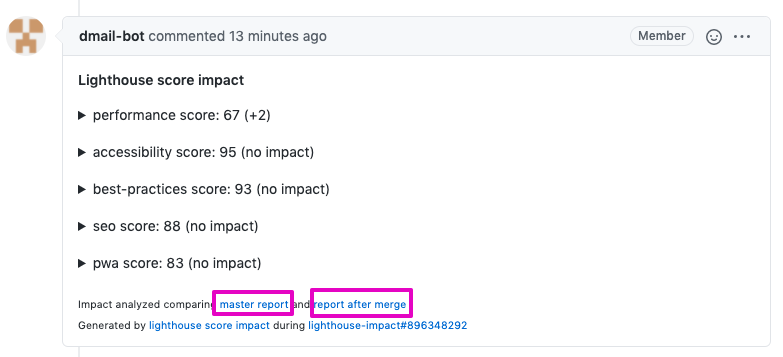

# Lighthouse impact [](https://www.npmjs.com/package/@jsenv/lighthouse-impact)

`@jsenv/lighthouse-impact` analyses a pull request impact on lighthouse score. This analysis is posted in a comment of the pull request on GitHub.

- Helps you to catch lighthouse score impacts before merging a pull request
- Gives you the ability to get lighthouse report on your machine during dev
- Can be added to any automated process (GitHub workflow, Jenkins, ...)

# Pull request comment

_Screenshot of a pull request comment_


_Screenshot of comment when expanded_


# Installation

The first thing you need is a script capable to generate a lighthouse report.

```console
npm install --save-dev @jsenv/lighthouse-impact
```

_lighthouse.mjs_

```js
/*
 * This file gives the ability to generate a lighthouse report
 * - It starts a local server serving a single basic HTML file
 * - It is meant to be modified to use your own server and website files
 */
import { createServer } from "node:http"
import { readFileSync } from "node:fs"
import { generateLighthouseReport } from "@jsenv/lighthouse-impact"

const htmlFileUrl = new URL("./index.html", import.meta.url)
const html = String(readFileSync(htmlFileUrl))

const server = createServer((request, response) => {
  response.writeHead(200, {
    "content-type": "text/html",
  })
  response.end(html)
})
server.listen(8080)
server.unref()

export const lighthouseReport = await generateLighthouseReport(
  "http://127.0.0.1:8080",
)
```

_index.html_

```html
<!DOCTYPE html>
<html>
  <head>
    <title>Title</title>
    <meta charset="utf-8" />
    <link rel="icon" href="data:," />
  </head>
  <body>
    Hello, World!
  </body>
</html>
```

At this stage, you could generate a lighthouse report on your machine. For an example, see [package.json#L37](./package.json#L37) and [script/lighthouse/lighthouse.mjs#L19](./script/lighthouse/lighthouse.mjs#L19).

Now it's time to configure a workflow to compare lighthouse reports before and after merging a pull request.

## GitHub workflow

_.github/workflows/lighthouse_impact.yml_

```yml
# This is a GitHub workflow YAML file
# see https://docs.github.com/en/actions/reference/workflow-syntax-for-github-actions
#
# For every push on a pull request, it
# - starts a machine on ubuntu
# - clone the git repository
# - install node, install npm deps
# - Executes report_lighthouse_impact.mjs

name: lighthouse impact

on: pull_request_target

jobs:
  lighthouse_impact:
    runs-on: ubuntu-latest
    name: lighthouse impact
    steps:
      - name: Setup git
        uses: actions/checkout@v2
      - name: Setup node
        uses: actions/setup-node@v2
        with:
          node-version: "16.13.0"
      - name: Install node modules
        run: npm install
      - name: Report lighthouse impact
        run: node ./report_lighthouse_impact.mjs
```

_report_lighthouse_impact.mjs_

```js
/*
 * This file is executed by lighthouse_impact.yml GitHub workflow.
 * - it generates lighthouse report before and after merging a pull request
 * - Then, it creates or updates a comment in the pull request
 * See https://github.com/jsenv/lighthouse-impact#how-it-works
 */

import {
  reportLighthouseImpact,
  readGitHubWorkflowEnv,
} from "@jsenv/lighthouse-impact"

await reportLighthouseImpact({
  ...readGitHubWorkflowEnv(),
  lighthouseReportPath: "./lighthouse.mjs#lighthouseReport",
})
```

## Other tools

If you want to use an other tool than GitHub worflow to run the pull request comparison, like Jenkins, there is a few things to do:

1. Replicate _lighthouse_impact.yml_
2. Adjust _report_lighthouse_impact.mjs_
3. Create a GitHub token (required to post comment on GitHub)

### 1. Replicate _lighthouse_impact.yml_

Your script must reproduce the state where your git repository has been cloned and you are currently on the pull request branch. Something like the commands below.

```console
git init
git remote add origin $GITHUB_REPOSITORY_URL
git fetch --no-tags --prune origin $PULL_REQUEST_HEAD_REF
git checkout origin/$PULL_REQUEST_HEAD_REF
npm install
node ./report_lighthouse_impact.mjs
```

### 2. Adjust _report_lighthouse_impact.mjs_

When outside a GitHub workflow, you cannot use _readGitHubWorkflowEnv()_.
It means you must pass several parameters to _reportLighthouseImpact_.
The example below assume code is executed by Travis.

```diff
- import { reportLighthouseImpact, readGitHubWorkflowEnv } from "@jsenv/lighthouse-impact"
+ import { reportLighthouseImpact } from "@jsenv/lighthouse-impact"

reportLighthouseImpact({
-  ...readGitHubWorkflowEnv(),
+  projectDirectoryUrl: process.env.TRAVIS_BUILD_DIR,
+  repositoryOwner: process.env.TRAVIS_REPO_SLUG.split("/")[0],
+  repositoryName: process.env.TRAVIS_REPO_SLUG.split("/")[1],
+  pullRequestNumber: process.env.TRAVIS_PULL_REQUEST,
+  githubToken: process.env.GITHUB_TOKEN, // see next step
   lighthouseReportPath: "./lighthouse.mjs#lighthouseReport",
})
```

### 3. Create a GitHub token

The GitHub token is required to be able to post a commment in the pull request.
You need to create a GitHub token with `repo` scope at https://github.com/settings/tokens/new.
Finally you need to setup this environment variable. The exact way to do this is specific to the tools your are using.

# Lighthouse report viewer

The pull request comment can contain links to see lighthouse reports in [Lighthouse Report Viewer](https://googlechrome.github.io/lighthouse/viewer).



To unlock this you need a GitHub token with the right to create gists.
Every github workflow has access to a magic token `secrets.GITHUB_TOKEN`.
But this token is not allowed to create gists.
We need to update the worflow file like [lighthouse-score-impact.yml#L21](./.github/workflows/lighthouse_impact.yml#L21) to use an other token that will have the rights to create gists.

```diff
- GITHUB_TOKEN: ${{ secrets.GITHUB_TOKEN }}
+ GITHUB_TOKEN: ${{ secrets.LIGHTHOUSE_GITHUB_TOKEN }}
```

You can generate a new token at https://github.com/settings/tokens/new. That token needs `repo` and `gists` scope. Copy this token and add it to your repository secrets at https://github.com/REPOSITORY_OWNER/REPOSITORY_NAME/settings/secrets/new. For this example the secret is named `LIGHTHOUSE_GITHUB_TOKEN`.

# How it works

In order to analyse the impact of a pull request on lighthouse score this project does the following:

1. Checkout pull request base branch
2. Generates a lighthouse report
3. Merge pull request into its base
4. Generates a second lighthouse report
5. Analyse differences between the two lighthouse reports
6. Post or update comment in the pull request
